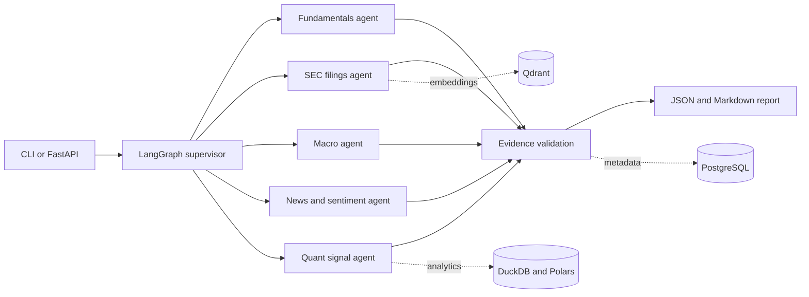

# Autonomous Financial Research Agent

An evidence-first backend that behaves like a supervised junior quantitative research
analyst for US-listed equities. It combines structured market and macro data with SEC
filings and news, calculates deterministic signals, and produces cited JSON and Markdown.

> **Current milestone:** this repository is a runnable base outline. Demo mode uses clearly
> labeled synthetic fixtures. Live provider methods intentionally fail closed until their
> retrieval, normalization, and provenance logic is implemented and tested.

## Architecture



## Project layout

```text
src/fin_research/
  agents/       specialist workers and supervisor
  analytics/    deterministic quantitative calculations
  api/          FastAPI application
  data/         source interfaces and demo fixtures
  database/     PostgreSQL models and sessions
  evaluation/   quality metrics
  ingestion/    public-source clients and normalization
  models/       Pydantic contracts and graph state
  services/     orchestration, guardrails, reporting
evaluation/     ten sample research cases
tests/          unit and integration tests
docs/           design notes
scripts/        evaluation entry points
notebooks/      notebook-ready usage example
```

## Installation

Python 3.11 or newer is required.

```bash
python -m venv .venv
source .venv/bin/activate
python -m pip install -e '.[dev,live]'
cp .env.example .env
pytest
```

## Environment variables

| Variable | Purpose | Required |
|---|---|---|
| `DATA_MODE` | `demo` or `live`; defaults to safe demo mode | No |
| `DATABASE_URL` | PostgreSQL async connection URL | For persistence |
| `QDRANT_URL` | Qdrant service URL | For semantic retrieval |
| `FRED_API_KEY` | FRED API access | For live macro data |
| `ALPHA_VANTAGE_API_KEY` | Optional market-data fallback | No |
| `LLM_API_KEY` | Future grounded synthesis provider | For LLM synthesis |
| `SEC_USER_AGENT` | Identifying SEC request header | For live SEC data |

## CLI usage

```bash
python main.py --ticker AMD
```

The command prints structured JSON and writes `reports/amd-research.md`.

## API usage

```bash
uvicorn fin_research.api.app:app --reload
curl -X POST http://localhost:8000/research \
  -H 'Content-Type: application/json' \
  -d '{"ticker":"AMD"}'
```

Interactive API documentation is available at `http://localhost:8000/docs`.

## Sample output

```json
{
  "ticker": "AMD",
  "status": "complete",
  "key_financial_metrics": [],
  "recent_sec_developments": {"status": "complete", "claims": []},
  "macro_environment": {"status": "complete", "metrics": []},
  "recent_events": {"status": "complete", "claims": []},
  "quantitative_signals": {"status": "complete", "metrics": []},
  "bull_thesis": [],
  "bear_thesis": [],
  "catalysts": [],
  "risks": [],
  "model_confidence": 0.55,
  "citations": [],
  "warnings": ["DEMO DATA: output is synthetic and must not be used for investment decisions."]
}
```

## Data sources

- SEC EDGAR submissions, filings, and XBRL company facts
- Yahoo Finance/yfinance, with Alpha Vantage as an optional fallback
- FRED macroeconomic series
- GDELT and company investor-relations feeds
- Reddit only where public API terms and access permit it

## Evidence and hallucination safeguards

- Facts require citation identifiers at schema-validation time.
- Citation identifiers must resolve to report-level source objects.
- Uncited numerical interpretations are rejected.
- Forecasts must carry explicit assumptions.
- Calculations live in deterministic Polars code, not LLM prompts.
- Missing live data yields an error or partial status, never invented values.

## Evaluation

`evaluation/sample_queries.json` contains ten representative US equity cases. The evaluator
measures citation coverage, factual consistency, response completeness, retrieval relevance,
and hallucination rate. Retrieval relevance is a placeholder score in this outline and will
be replaced by labeled judgments when live retrieval lands.

```bash
python scripts/run_evaluation.py
```

## Docker

```bash
cp .env.example .env
docker compose up --build
```

This starts the API, PostgreSQL, and Qdrant. Database and vector persistence boundaries are
present, but wiring writes/indexing into the graph belongs to the next implementation phase.

## Limitations

- Live source adapters beyond the initial SEC client are not implemented in this base outline.
- Demo metrics are synthetic and deliberately unsuitable for investment decisions.
- No investment recommendation, target price, or portfolio sizing is produced.
- Free sources can be delayed, revised, rate-limited, or incomplete.
- Filing extraction and sentiment models require evaluation before production use.

## Roadmap

1. Complete live SEC/XBRL and market-data adapters with cache-backed integration tests.
2. Add FRED, GDELT, and investor-relations retrieval.
3. Add Qdrant chunk indexing and PostgreSQL run persistence.
4. Add grounded LLM synthesis with structured output and quote verification.
5. Add temporal evaluation, source-relevance labels, and regression dashboards.
6. Add observability, job queues, authentication, and deployment hardening.

## Disclaimer

This project is for research and education. It is not investment advice.

