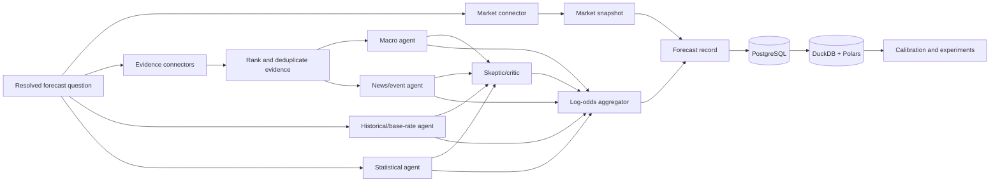

# Multi-Agent Prediction Market Intelligence

A research-grade Python platform for producing, storing, and evaluating probabilistic forecasts against prediction-market consensus. The system answers a narrow question—**what is the probability of a well-defined event?**—and explicitly does **not** recommend trades.

> **Research question:** Do multi-agent AI systems improve probabilistic forecasting beyond prediction-market consensus?

The current release is a runnable vertical slice: modular public-data connectors, a LangGraph forecasting workflow, independent quantitative and evidence-based agents, a skeptical critic, log-odds aggregation, permanent PostgreSQL-compatible storage, DuckDB/Polars analytics, proper scoring, experiment arms, API endpoints, Docker, and tests. LLM-specific providers are intentionally behind the agent boundary; deterministic baselines keep experiments reproducible and usable without paid keys.

## Architecture



The connector interfaces isolate vendor schemas. `MarketConnector` supports snapshots/history/search; `EvidenceConnector` returns normalized, timestamped evidence. Adding Kalshi, BLS, BEA, SEC EDGAR, GDELT, polling, or a licensed feed does not change the forecast domain.

## Forecasting methodology

1. **Specify the event.** Each event needs unambiguous resolution criteria and a cutoff time. Vague questions cannot be scored reliably.
2. **Set a prior.** The historical agent uses a reference-class base rate. Category defaults are scaffolding, not publishable estimates.
3. **Retrieve timestamped evidence.** Evidence is ranked by relevance, recency, and source credibility. A future production pass should add embedding retrieval, claim clustering, and provenance-aware deduplication.
4. **Forecast independently.** Macro, news, historical, and statistical agents emit a probability, confidence, rationale, and metadata. The critic looks for correlation and overconfidence.
5. **Aggregate.** Probabilities are pooled in log-odds space with confidence-adjusted weights. The uncertainty interval expands with disagreement.
6. **Freeze and persist.** The complete forecast, model version, evidence, agent opinions, and simultaneous market snapshot are immutable research observations.
7. **Resolve and score.** Outcomes are joined only after resolution. Performance is evaluated out of sample and through time.

### Bayesian update

For binary outcome `Y` and evidence `E`:

```text
posterior odds(Y | E) = prior odds(Y) × P(E | Y) / P(E | not Y)
```

The final factor is the likelihood ratio. Correlated evidence must not be multiplied as though independent. The platform downweights evidence by relevance and credibility and the critic shrinks consensus when sources appear duplicated.

### Aggregation

For agent probabilities `p_i` and weights `w_i`, the logarithmic opinion pool is:

```text
p* = sigmoid( Σ w_i logit(p_i) / Σ w_i )
```

Initial weights are transparent configuration. Research claims require learning them on a past-only training window and evaluating on later events.

## Measuring forecast quality

For forecast `p_t` and binary outcome `y_t`:

**Brier score** (lower is better):

```text
BS = (1/N) Σ (p_t - y_t)²
```

**Log loss** (lower is better and strongly penalizes confident mistakes):

```text
LL = -(1/N) Σ [y_t log(p_t) + (1-y_t) log(1-p_t)]
```

**Calibration** means events assigned probability `p` occur with empirical frequency `p`. A reliability diagram plots observed frequency against mean forecast within probability bins. The diagonal is ideal, but bin-level uncertainty must be shown when samples are small.

**Sharpness** measures how far forecasts move from 50%; it is valuable only if calibration is maintained. **Resolution** measures how well forecasts separate groups with different outcome frequencies. **Rolling Brier score** reveals regime changes and model degradation. Market-vs-model comparison must use prices sampled at the same information cutoff.

## Experiment design

The registered arms are:

| Arm | Probability source | Purpose |
|---|---|---|
| Market alone | contemporaneous market price | consensus benchmark |
| LLM alone | one frozen prompt/model | language-model baseline |
| Statistical alone | calibrated numeric model | non-LLM baseline |
| Multi-agent | pooled independent agents + critic | primary treatment |
| Market + AI | preregistered blend | complementarity test |

Use a shared, preregistered event set and walk-forward splits. Freeze event wording, evidence cutoff, model/prompt versions, and market timestamp. Compare paired Brier and log-loss differences, bootstrap confidence intervals by event, calibration error with uncertainty bands, and performance by category/horizon. Never tune on test-period resolutions. Log runs and artifacts to MLflow.

A convincing paper should additionally address market liquidity, stale prices, resolution ambiguity, repeated-event dependence, selection effects, probability revisions, transaction-free versus executable market prices, and multiple comparisons.

## Data sources

Implemented now:

- Polymarket public Gamma market snapshots
- FRED observations (when `FRED_API_KEY` is configured)
- static offline connectors for deterministic tests and demonstrations

Connector targets on the roadmap: Kalshi public endpoints where permitted, BLS, BEA, Federal Reserve releases, SEC EDGAR, GDELT, public economic calendars, Yahoo Finance-compatible price data, and public polling datasets. Review each source's terms, rate limits, revision policy, and archival availability before research collection.

## Quick start

Python 3.11+ is required.

```bash
cp .env.example .env
python -m venv .venv
source .venv/bin/activate
python -m pip install -e '.[dev]'
pytest
uvicorn prediction_market_agents.api:app --reload
```

Or run PostgreSQL, MLflow, and the API:

```bash
cp .env.example .env
docker compose up --build
```

OpenAPI documentation is at `http://localhost:8000/docs`; MLflow is at `http://localhost:5000`.

## API examples

Create a forecast (replace the market ID with a live Polymarket market):

```bash
curl -X POST http://localhost:8000/v1/forecasts \
  -H 'content-type: application/json' \
  --data @examples/fed_cut.json
```

Resolve an event after its authoritative outcome is known:

```bash
curl -X POST http://localhost:8000/v1/resolutions \
  -H 'content-type: application/json' \
  -d '{"event_id":"EVENT_UUID","outcome":1,"source_url":"https://authoritative-source.example"}'
```

Dashboard-ready reads:

```text
GET /v1/forecasts/{forecast_id}             full forecast and agent opinions
GET /v1/events/{event_id}/history           market-vs-model probability history
GET /v1/metrics?source=model                Brier, log loss, calibration, sharpness, resolution
GET /v1/metrics?source=market               matched market benchmark
GET /v1/experiments/leaderboard             research-arm comparison
```

Example response fields include market probability, model probability, percentage-point edge, uncertainty interval, positive/negative evidence, base rate, agent disagreement, and final methodology. Edge is descriptive and **not a trade recommendation**.

## Repository map

```text
src/prediction_market_agents/
  agents/             independent forecasters, critic, aggregator
  connectors/         normalized market/evidence interfaces
  api.py               FastAPI routes
  orchestration.py     LangGraph state machine
  domain.py            Pydantic research contracts
  math.py              Bayesian updates and proper scores
  statistical.py       calibrated scikit-learn baseline
  storage.py           PostgreSQL/SQLite transactional records
  analytics.py         DuckDB/Polars rolling analytics
  evaluation.py        calibration and scoring
  experiments.py       comparable research arms
docs/TEACHING.md       concept lessons and quizzes with answers
tests/                 unit and end-to-end offline tests
```

## Results

No empirical superiority claim is made yet. Populate this section only after a preregistered out-of-sample run.

| Test window | Events | Arm | Brier ↓ | Log loss ↓ | Calibration | Resolution ↑ |
|---|---:|---|---:|---:|---:|---:|
| TBD | TBD | Market | TBD | TBD | TBD | TBD |
| TBD | TBD | Multi-agent | TBD | TBD | TBD | TBD |
| TBD | TBD | Market + AI | TBD | TBD | TBD | TBD |

## Limitations

- Category default priors and initial weights are scaffolding; they are not learned or validated.
- The current interval is disagreement-based, not a frequentist coverage guarantee. Replace it with rolling conformal or hierarchical Bayesian intervals after sufficient outcomes.
- Source credibility and likelihood ratios require a documented estimation protocol.
- Public market prices can be illiquid, stale, fee-free abstractions, or sensitive to contract wording.
- Forecast quality depends on event-resolution quality; adjudication and source revision handling need governance.
- LLM retrieval/providers are not included by default, preserving offline reproducibility and avoiding hidden paid dependencies.
- SQLite is the zero-setup development default; PostgreSQL is the intended multi-user production store.

## Roadmap

1. Add Alembic migrations, job queue/scheduler, retries, caching, tracing, and secrets management.
2. Add archived point-in-time connectors for every listed public source and market price history.
3. Add claim-level evidence deduplication and source lineage.
4. Train category/horizon-specific statistical models with walk-forward validation.
5. Add frozen LLM-provider adapters with structured outputs, prompt versioning, and token/cost logs.
6. Learn aggregation weights without leakage and add calibrated/conformal uncertainty intervals.
7. Add bootstrap significance tests, revision policies, resolution adjudication, and MLflow run logging.
8. Build the calibration, history, leaderboard, and market-vs-model dashboard against the existing APIs.

## Learn the system

Start with [`docs/TEACHING.md`](docs/TEACHING.md). It explains odds-form Bayes, proper scoring, calibration, correlated-agent risk, and experimental design, then quizzes you after each module. Read the corresponding code in this order: `domain.py` → `math.py` → `agents/forecasting.py` → `orchestration.py` → `storage.py` → `evaluation.py` → `api.py`.

## Responsible use

This software is for forecasting research. Probabilities are uncertain estimates, connectors may fail, and markets can resolve unexpectedly. The API intentionally provides no automatic trade recommendation or order execution. 
