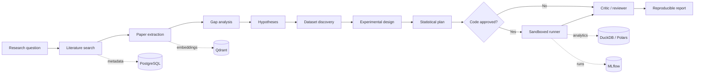

# Autonomous Quantitative Research Copilot

An agentic, reproducible research system that moves a quantitative question through literature review,
hypothesis formation, data discovery, experimental design, statistical analysis, critical review, and a
research report. It is infrastructure for research—not a paper summarizer and not an oracle.

## Why this project exists

Quantitative research fails quietly when sources cannot be verified, time splits leak future information,
experiments are overwritten, or model accuracy is presented as scientific evidence. This platform makes
those failure modes explicit. Every project retains its question, sources, hypotheses, specifications,
code, environment, logs, results, criticism, and report. 

## Architecture



The ten roles live in an inspectable LangGraph workflow. Pydantic models are contracts between roles.
The local research directory is canonical; PostgreSQL, Qdrant, and MLflow provide indexes and operational
views. See [the architecture decisions](docs/architecture.md) and the
[base code outline](docs/base-code-outline.md).

## Supported workflow

1. Create a persistent research project.
2. Search arXiv and Crossref and retain verifiable metadata locally (Semantic Scholar/SSRN/GitHub adapters
   are roadmap items).
3. Extract question, hypothesis, datasets, methods, models, baselines, metrics, results, limitations, and
   supporting passages into structured records.
4. Identify contradictions and gaps, then propose falsifiable hypotheses.
5. Create an experiment specification that names variables, controls, splits, tests, leakage, confounders,
   corrections, and robustness checks.
6. Review generated Python before running it in a network-disabled, resource-limited Docker container.
7. Record immutable run code, hashes, environment, logs, parameters, and results.
8. Review claims for unknown sources, unsupported conclusions, and unevidenced numerical statements.
9. Report observed results, statistical inference, and AI interpretation as separate claim types.

## Quick start

```bash
python -m venv .venv
source .venv/bin/activate
pip install -e '.[dev]'
pytest
uvicorn research_copilot.api:app --reload
```

Or start the API and backing services:

```bash
docker compose up --build
```

Open `http://localhost:8000/docs` for the interactive API.

## Example research session

Create a project:

```bash
curl -X POST http://localhost:8000/research/projects \
  -H 'content-type: application/json' \
  -d '{"name":"Prediction Market Equity Volatility","research_question":"Do prediction-market probabilities improve short-horizon equity-volatility forecasts?"}'
```

Use its returned `id` to search literature:

```bash
curl -X POST http://localhost:8000/research/literature/search \
  -H 'content-type: application/json' \
  -d '{"project_id":"PROJECT_UUID","query":"prediction markets equity volatility forecasting","sources":["arxiv","crossref"],"limit":10}'
```

The intended first experiment compares a volatility-only baseline such as HAR-RV with an augmented model
using timestamp-safe prediction-market features. A walk-forward evaluation should report QLIKE and
out-of-sample R², block-bootstrap uncertainty, a forecast comparison test, effect size, and sensitivity to
horizons, event windows, and multiple hypotheses. This is a plan—not an empirical result.

## Research memory and reproducibility

```text
research_projects/<project>/
├── question.yaml
├── literature/papers.jsonl
├── datasets/
├── hypotheses/
├── experiments/<experiment-id>/
│   ├── spec.json
│   └── runs/<timestamp-and-random-id>/
│       ├── analysis.py
│       ├── environment.json
│       ├── stdout.log
│       ├── stderr.log
│       └── result.json
├── results/
└── reports/
```

Create-only project/spec writes and unique run paths prevent accidental replacement of prior evidence.
Dataset checksums and lockfiles should be added before claiming bit-for-bit reproduction.

## Statistical rigor

Experiment contracts support train/validation/test, time-series, and walk-forward splits; bootstrap
intervals; hypothesis tests; multiple-comparison correction; effect size; calibration; and robustness
checks. Predictive improvement, statistical distinguishability, practical effect, and causal interpretation
are four different questions and must be reported separately.

## Evaluation framework

- Citation verification: every paper requires a resolvable DOI, arXiv ID, or Semantic Scholar ID.
- Grounding: structured extraction can retain evidence passages for each field.
- Claim checking: unknown evidence, unsupported conclusions, and ungrounded numerical claims are flagged.
- Research review: the critic checks leakage, confounding, selection bias, specification searching, and
  whether conclusions exceed the design.
- Report labels: empirical observations, statistical inference, and AI interpretation are distinct types.

## API

- `POST /research/projects`
- `POST /research/literature/search`
- `POST /research/hypothesis`
- `POST /research/experiment?project_id=<uuid>`
- `GET /research/results/{experiment_id}`
- `GET /health`

## Limitations

This MVP includes live arXiv/Crossref adapters but not yet production PostgreSQL repositories, embedding
generation, full-text PDF extraction, an LLM provider, dataset licensing automation, distributed workers,
or authentication. Docker is a useful local containment layer, not a perfect hostile-code sandbox. SSRN
access must respect its terms and technical controls. No generated report should be treated as peer review,
investment advice, or evidence until its sources, data, code, and statistical assumptions are inspected.

## Roadmap

- PostgreSQL repositories and typed knowledge-graph migrations
- Qdrant hybrid semantic/keyword retrieval with embedding provenance
- Semantic Scholar, GitHub, Papers With Code, and legally accessible SSRN connectors
- PDF retrieval, evidence-grounded extraction, citation graph expansion, and deduplication
- Dataset cards, licenses, immutable snapshots, hashes, and point-in-time availability audits
- LLM tool adapters, human approval UI, resumable LangGraph checkpoints, and role-specific prompts
- DuckDB/Polars experiment templates, PyTorch baselines, MLflow logging, and calibration diagnostics
- Reproducible HTML/PDF reports and automated claim-to-artifact traceability
- Authentication, quotas, isolated worker nodes, image allowlists, and supply-chain controls

## Professional relevance

The project demonstrates AI-agent orchestration, typed tool boundaries, retrieval infrastructure, sandboxed
execution, experiment tracking, statistical discipline, and reproducible research engineering—skills shared
across AI Engineering, ML Research Engineering, Quantitative Research, and prediction-market research.
