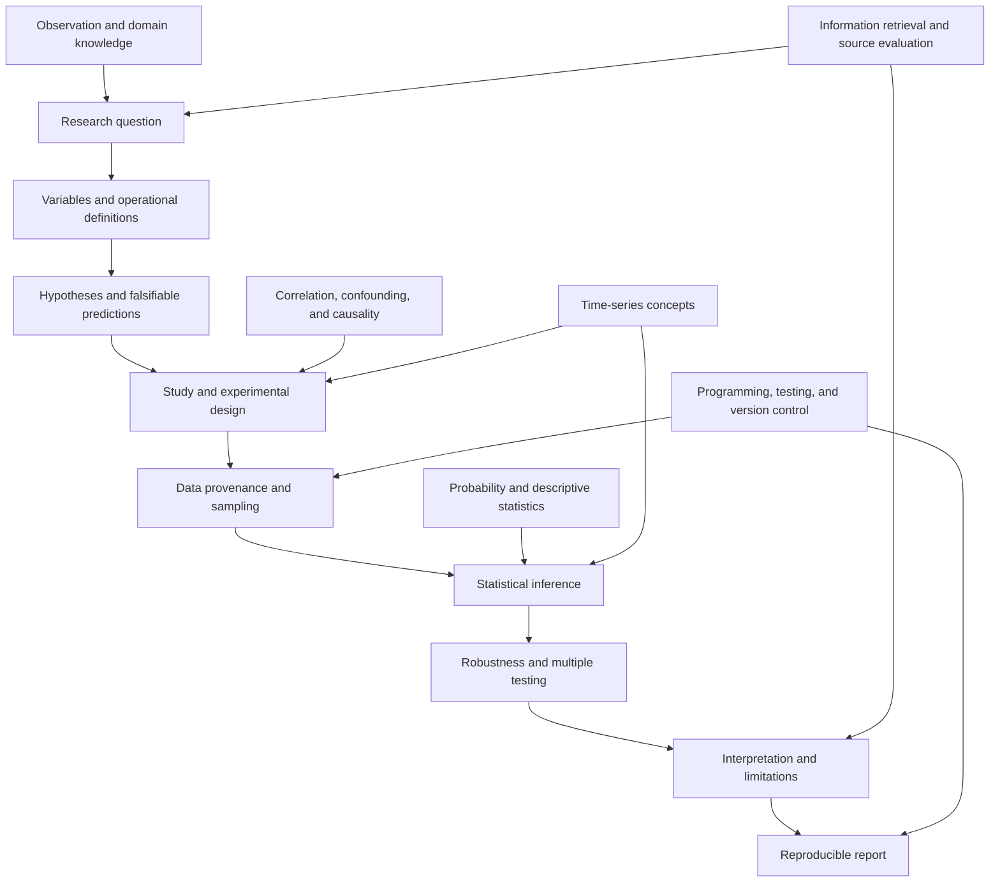
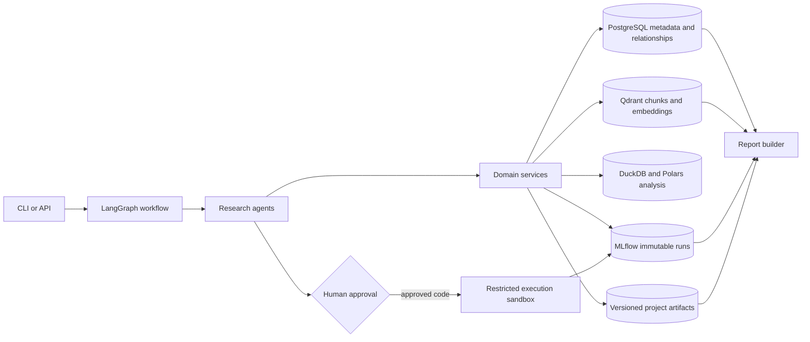

# Autonomous Quantitative Research Copilot: Learning Curriculum

This is a research-methods-first curriculum. The copilot is not built during this phase. Each milestone
produces a small, reviewable artifact, and implementation begins only after the scientific foundations and
system contracts are understood.

## 1. Scientific-method prerequisite map

The dependency order matters. Retrieval cannot repair an untestable question, a sophisticated model cannot
repair leakage, and a small p-value cannot justify a causal conclusion from a non-causal design.

### Readiness checklist

Before automating a research stage, the researcher should be able to:

- express a question in terms of a population, variables, comparison, and horizon;
- distinguish a hypothesis from a prediction;
- identify treatment/exposure, outcome, controls, confounders, and possible mediators;
- explain what evidence would contradict the proposed claim;
- distinguish predictive association, statistical inference, practical importance, and causality;
- select a split design without allowing future information into training;
- trace every claim to a source, dataset snapshot, or immutable experiment run.

## 2. Complete curriculum and milestones

The 24 milestones below combine the requested teaching modules with concrete artifacts and gates.

| # | Milestone | Core ideas | Required artifact / completion gate |
|---:|---|---|---|
| 1 | Scientific method | observation, question, hypothesis, prediction, test, interpretation, falsifiability | Convert one observation into a falsifiable study chain |
| 2 | Research questions | scope, testability, measurable outcomes, population, horizon | Rewrite five vague questions as testable questions |
| 3 | Variables | independent/dependent variables, controls, confounders, mediators | Variable table plus causal sketch for one study |
| 4 | Correlation and causation | association, reverse causality, omitted-variable bias, identification | Label the strongest defensible claim for three designs |
| 5 | Literature-search strategy | concepts, synonyms, Boolean search, inclusion/exclusion criteria | Search protocol and query matrix |
| 6 | Scholarly data sources | arXiv, Semantic Scholar, Crossref, GitHub, Papers With Code, SSRN constraints | API notebook with cached raw responses and provenance |
| 7 | Citation chaining | backward/forward citations, foundational versus recent work | Seed-paper citation map and search log |
| 8 | Structured paper reading | question, hypotheses, data, method, baseline, metrics, results, limitations | Completed paper schema with evidence spans |
| 9 | Embeddings | vectors, similarity, cosine similarity, limitations | Hand calculation and small verified implementation |
| 10 | Vector retrieval | exact/approximate neighbors, indexing, recall/latency trade-offs | Retrieval evaluation set and Recall@k report |
| 11 | Evidence-grounded RAG | parse, chunk, embed, retrieve, rerank, cite | Answers whose claims link to exact source passages |
| 12 | Research knowledge graph | entities, typed edges, provenance, relational representation | PostgreSQL schema and example queries; no Neo4j required |
| 13 | Hypothesis development | null/alternative, directional claims, preregistration | Falsifiable hypothesis set with decision rules |
| 14 | Experimental design | estimand, treatment, control, baseline, metrics, tests | Reviewed experiment specification |
| 15 | Data splitting | train/validation/test, chronological splits, nested selection | Split diagram and leakage audit |
| 16 | Statistical inference | sampling distributions, confidence intervals, p-values, effect sizes, power | Analysis plan written before viewing test results |
| 17 | Bootstrap | resampling units, percentile/BCa/block intervals | Bootstrap interval implementation with tests |
| 18 | Multiple comparisons | family-wise error, Bonferroni/Holm, FDR, model selection bias | Correction plan defining the hypothesis family |
| 19 | Time-series research | autocorrelation, non-stationarity, regimes, walk-forward tests | Point-in-time feature audit and walk-forward protocol |
| 20 | Reproducibility | seeds, environments, data hashes, Git commits, immutable outputs | Reproduction manifest and rerun checklist |
| 21 | Experiment tracking | MLflow concepts, parameters, metrics, artifacts, lineage | Two immutable runs and a comparison record |
| 22 | Agent engineering | state, tools, typed boundaries, retries, approvals, checkpoints | Agent contracts and failure tests, not autonomous execution |
| 23 | Safe execution | review, sandboxing, permissions, dependency/network/time/memory limits | Threat model and explicit human approval gate |
| 24 | Evaluation and reporting | hallucination tests, critic behavior, evidence/inference/interpretation labels | Audited report with traceable claims and limitations |

### Suggested learning cadence

For each milestone: study the concept, complete the artifact manually, encode its schema, write adversarial
tests, and only then automate it. Automation passes only when it preserves provenance and fails safely when
evidence is missing.

## 3. Target architecture

This is a target design, not an instruction to implement every component now.

### Architectural rules

- Pydantic contracts define state passed between roles; prose is never the only interface.
- The local project directory is the durable research record. Databases provide queries and indexes.
- PostgreSQL represents typed relationships initially; a graph database is added only if demonstrated query
  needs justify its operational cost.
- Qdrant stores chunks plus embedding model/version and source locations, not unsupported summaries.
- DuckDB and Polars perform inspectable data work; PyTorch is introduced only for justified models.
- MLflow runs and filesystem run directories are create-only. A rerun receives a new ID.
- Generated code is an untrusted proposal until a human approves it. Execution has no network by default,
  restricted mounts, pinned dependencies, CPU/memory/time limits, and captured logs.
- A report claim must point to a paper passage, dataset/version, experiment/run, or be labeled as AI
  interpretation.

## 4. Agent architecture

Agents are narrow workflow roles, not independent authorities.

| Agent | Inputs | Outputs | Critical guardrail |
|---|---|---|---|
| Literature Search | approved question and search protocol | candidate source records | Never invent metadata; verify stable identifiers |
| Paper Extraction | paper text and metadata | structured paper records with evidence spans | Use `unknown`, not guesses |
| Research Gap | verified extractions | contradictions, omissions, open questions | Absence from retrieved papers is not proof of a field-wide gap |
| Hypothesis | question, theory, gap candidates | falsifiable null/alternative hypotheses | No post-result hypothesis rewriting |
| Dataset Discovery | variables and hypotheses | dataset cards, versions, access and license notes | Check point-in-time availability and construct validity |
| Experimental Design | hypothesis and dataset cards | estimand, split, baseline, metrics, tests, robustness plan | Block execution when leakage or identification is unresolved |
| Statistical Analysis | frozen design and run outputs | estimates, intervals, tests, diagnostics | Report effect size and uncertainty, not p-values alone |
| Code Execution | approved code and environment | immutable logs, artifacts, hashes, results | Sandboxed execution after human review only |
| Critic | complete evidence graph | severity-ranked objections and required fixes | Seek disconfirmation; never merely agree |
| Report | verified sources, runs, and critique | structured research report | Separate observation, inference, and interpretation |

Every agent returns validation errors and uncertainty. A workflow checkpoint precedes hypothesis approval,
data approval, code execution, and final publication.

## 5. Research workflow

1. Record an observation without explaining it yet.
2. Frame and scope a testable research question.
3. Operationalize variables, population, comparison, and time horizon.
4. Predefine literature queries and inclusion/exclusion criteria.
5. Retrieve and verify sources; record the full search trail.
6. Extract structured evidence and build a citation/relationship map.
7. Identify candidate gaps, explicitly limited to the searched evidence.
8. State the theory, null hypothesis, alternative, and falsifying result.
9. Assess datasets for provenance, version, licensing, coverage, and point-in-time correctness.
10. Freeze an experiment specification: estimand, split, baselines, metrics, tests, correction family, and
    robustness checks.
11. Review generated analysis code and environment before execution.
12. Execute in a restricted environment and retain a new immutable run.
13. Diagnose assumptions, estimate effects and uncertainty, and apply planned corrections.
14. Run preregistered robustness and sensitivity analyses; label exploratory work separately.
15. Have the critic challenge leakage, confounding, selection, statistics, citations, and claim strength.
16. Produce a report containing Abstract, Research Question, Literature Review, Hypothesis, Data,
    Methodology, Results, Statistical Analysis, Robustness Tests, Limitations, and Future Research.

The final report labels claims as:

- **Observed evidence:** directly present in a source, dataset, or run artifact.
- **Statistical inference:** an estimate or decision under explicit assumptions and uncertainty.
- **AI interpretation:** a synthesis or proposed explanation that is not itself observed evidence.

## 6. Statistical concepts required

### Foundations

- random variables, probability distributions, expectation, variance, covariance, and conditional
  probability;
- populations, samples, estimands, estimators, sampling distributions, bias, variance, and consistency;
- descriptive statistics, missing data, outliers, transformations, and measurement error.

### Estimation and testing

- standard errors, confidence intervals, null/alternative hypotheses, Type I and Type II errors;
- p-values (what they are and are not), effect sizes, minimum detectable effect, and statistical power;
- parametric assumptions, permutation tests, bootstrap intervals, and appropriate resampling units;
- multiple comparisons, family definitions, Bonferroni/Holm control, and false-discovery-rate control.

### Modeling and validation

- linear/logistic regression, residual diagnostics, regularization, calibration, discrimination, and proper
  scoring rules;
- train/validation/test separation, cross-validation, nested selection, and comparison against meaningful
  baselines;
- specification uncertainty, researcher degrees of freedom, and the danger of selecting the best of 100
  models: even null models can produce apparently strong results through repeated search.

### Causal and time-series concepts

- potential outcomes or DAG-based reasoning, confounding, selection bias, colliders, mediators, reverse
  causality, and identification assumptions;
- autocorrelation, stationarity, structural breaks, overlapping horizons, clustered/block uncertainty,
  expanding/rolling windows, and walk-forward evaluation;
- for forecasting: out-of-sample loss, calibration, forecast comparison, economic/practical significance,
  and timestamp-safe feature availability.

No component may use causal verbs such as “causes,” “impacts,” or “leads to” unless the design and stated
identification assumptions support a causal estimand.

## 7. Interview skills demonstrated

- **Research design:** translate ambiguous business/domain questions into testable estimands and hypotheses.
- **Statistical judgment:** distinguish prediction, inference, practical significance, and causality.
- **Quantitative engineering:** construct leakage-safe time-series evaluations and reproducible analysis.
- **AI engineering:** design typed agent state, tool boundaries, approvals, checkpoints, and evaluations.
- **RAG engineering:** build evidence-preserving ingestion, retrieval, reranking, and citation validation.
- **Data engineering:** manage provenance, point-in-time data, hashes, versions, schemas, and immutable runs.
- **MLOps:** pin environments, test code, track experiments, and reproduce artifacts with MLflow and Git.
- **Security:** threat-model generated code and enforce isolation, resource limits, and least privilege.
- **Critical communication:** explain assumptions and limitations and calibrate claims to evidence.
- **System design:** defend when PostgreSQL, Qdrant, DuckDB/Polars, PyTorch, and Docker are—and are not—needed.

## 8. Module 1 — Scientific Method

### Learning objectives

By the end of this module, you should be able to turn an observation into a falsifiable question,
distinguish a hypothesis from its prediction, design a test that could fail, and interpret results without
overclaiming.

### The scientific-method chain

1. **Observation** — a recorded pattern or event, stated without a causal story. Example: “On some event
   days, prediction-market probabilities and equity volatility both change.” This observation may motivate
   research, but it proves nothing about association or causation.
2. **Research question** — a precise question about a population, measurable variables, comparison, and
   horizon. It must be answerable with obtainable evidence. “Are markets useful?” is too vague.
3. **Hypothesis** — a general, falsifiable claim about an association, difference, or causal effect. A null
   hypothesis usually states no effect/difference; an alternative states the prespecified effect of interest.
4. **Prediction** — the observable outcome expected if the hypothesis and auxiliary assumptions are true.
   A hypothesis is conceptual; a prediction connects it to a measurement and analysis.
5. **Experiment or study** — the protocol used to generate a fair comparison: sample, variables, baselines,
   timing, controls, metrics, tests, and decision rules. Observational studies are studies, not randomized
   experiments, and usually support weaker causal conclusions.
6. **Result** — what was measured: estimates, uncertainty, diagnostics, and test outcomes. “The coefficient
   was 0.12 with a 95% interval of [...]” is a result; “the signal works” is an interpretation.
7. **Interpretation** — what the results mean under the design's assumptions. It should consider sampling
   error, measurement error, confounding, alternative explanations, and practical effect size.
8. **Falsifiability** — a claim is scientific only if conceivable evidence can count against it. “The signal
   works whenever conditions are favorable” is insulated from failure. Predefined outcomes, thresholds, and
   contradictory results make a claim testable.

### A compact example

- Observation: Forecast errors appear larger around selected political events.
- Question: In a prespecified set of U.S. event windows, does adding timestamp-available prediction-market
  information improve one-day-ahead equity-volatility forecasts relative to a volatility-only baseline?
- Null hypothesis: The augmented model has no lower expected out-of-sample loss than the baseline.
- Alternative hypothesis: The augmented model has lower expected out-of-sample loss.
- Prediction: Under a frozen walk-forward protocol, the augmented model will have lower mean prespecified
  loss, with an uncertainty interval and forecast-comparison procedure defined in advance.
- Study: Use chronological splits, timestamp-safe features, a frozen baseline, and block-aware uncertainty.
- Possible result: Report the loss difference and interval—whether favorable, null, or adverse.
- Interpretation: A predictive improvement would support incremental forecasting information for the studied
  sample and horizon. It would not by itself establish that prediction-market changes cause volatility.

This example specifies how the eventual example could be studied; it does not answer it.

### Common failure modes

- Starting with a desired conclusion and seeking confirming evidence.
- Defining the outcome, horizon, or subgroup after seeing results.
- Treating failure to reject the null as proof that the null is true.
- Treating statistical significance as practical importance.
- Using a prediction result as a causal result.
- Hiding failed specifications and reporting only the best model.
- Writing an unfalsifiable escape clause for every adverse result.

## 9. Module 1 quiz

Answer before consulting the key.

1. “Technology affects markets” is best classified as an observation, a testable question, or an
   underspecified claim? Why?
2. What is the difference between a hypothesis and a prediction?
3. Give one result that would contradict: “Adding feature X improves one-day-ahead forecasts relative to
   baseline B under protocol P.”
4. Why can a statistically significant association fail to establish causality?
5. Which sentence is a result and which is an interpretation?
   - A: “Mean loss decreased by 0.7%, with a 95% interval from -0.2% to 1.6%.”
   - B: “Feature X contains economically useful information.”
6. Why should metrics and decision rules be chosen before examining test-set outcomes?
7. Is an observational study an experiment? What conclusions can it usually support?
8. What makes a claim falsifiable?

### Quiz key

1. An underspecified claim: the technology, market, variable, population, comparison, and horizon are absent.
2. A hypothesis is a general claim; a prediction is a measurable expected outcome under a stated design.
3. Equal or worse prespecified out-of-sample performance, with uncertainty inconsistent with the defined
   improvement criterion, would count against it.
4. Confounding, selection, reverse causality, measurement error, or an unsuitable design may explain it.
5. A is a result; B is an interpretation requiring a definition of “economically useful” and stronger support.
6. Post-outcome choices create researcher degrees of freedom and inflate false-positive risk.
7. Usually no: it observes rather than assigns exposure. It can support descriptive/predictive association;
   causal inference requires a defensible identification strategy and assumptions.
8. The claim names conceivable, observable evidence that would contradict it.

## 10. First exercise

Do this manually; do not search papers or write code yet.

Start from this neutral observation:

> Prediction-market probabilities and measures of equity-market volatility sometimes move during the same
> news cycle.

Submit a one-page **Scientific Method Card** containing:

1. **Observation:** Restate only what was noticed, without causal language.
2. **Research question:** Name the population/market, predictor, outcome, comparison, and forecast horizon.
3. **Operational definitions:** Define exactly how the predictor and outcome would be measured and timestamped.
4. **Null hypothesis:** State a no-improvement/no-difference claim.
5. **Alternative hypothesis:** State one directional or non-directional alternative.
6. **Prediction:** Name the observable result expected under the alternative.
7. **Falsifier:** Name a plausible result that would count against it.
8. **Study sketch:** In five sentences, name the data unit, chronological split, baseline, metric, and one
   important confounder or leakage risk.
9. **Claim boundary:** Complete: “If the prediction is supported, I may conclude ____. I may not conclude
   ____ because ____.”

### Self-assessment rubric (10 points)

- 2: question is specific, measurable, and scoped;
- 2: variables are operationalized with point-in-time timestamps;
- 2: null and alternative are mutually interpretable and falsifiable;
- 2: study includes a fair baseline and chronological evaluation;
- 2: conclusion is calibrated and avoids an unsupported causal claim.

A score below 8 means revise the card before moving to Module 2. The next teaching step should critique the
card, not run the proposed study.
